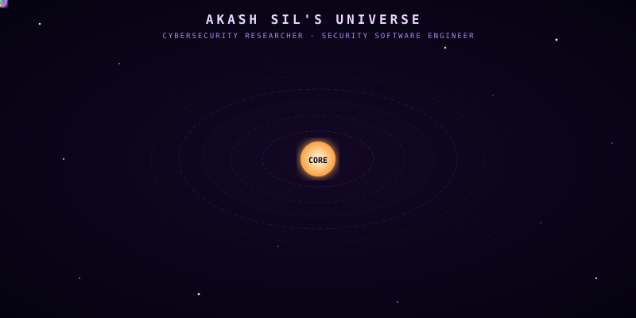
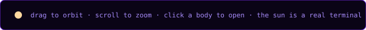

<div align="center">


<a href="https://akash420-oss.github.io/Akash-Sil-Portfolio">
  
</a>

---


[](https://akash-sil-portfolio.web.app)
[](https://github.com/Akash420-oss)
[](https://linkedin.com/in/akash-sil-102481216)
[](https://aur.archlinux.org/account/akashsil2392)


</div>

---

## 📖 The Origin Story Who Am I?

> *"You are about to board a rocket. It will put you in orbit around a small star system where every planet is something I have built or broken. The sun is a shell. The constellation is me. Nothing here is a slideshow fly it."*

I am **Akash Sil** a Cybersecurity Researcher, Security Software Engineer, and an explorer navigating the infinite digital cosmos in my own rocket. My journey began not with a destination in mind, but with a simple, relentless curiosity: *how do things break?*

That curiosity led me deep into the world of **Static Malware Analysis**, **Offensive Network Intelligence**, **Reverse Engineering**, and **Vulnerability Assessment & Penetration Testing (VAPT)**. I don't just find vulnerabilities I build the tools that find them. I maintain official packages on the **Arch User Repository (AUR)**, contribute to open-source security communities, and have published research in **IJRAR**.

In this fast-paced galaxy, technologies evolve at the speed of light. My philosophy is simple:

> **Upgrade your engines as fast as technology upgrades.**

This portfolio is the living manifestation of that journey an interactive 3D star system you can actually fly through, where every celestial body tells a part of my story.

---

## 🌌 The Universe — Interactive Navigation Guide

This is not a static resume. It is a **navigable star system**. Here's how to read it:

<div align="center">
  
</div>

### 🗺️ The Cosmic Legend

| Celestial Body | Symbol | Represents | How It Works |
| :---: | :---: | :--- | :--- |
| **The Sun** | ☀️ | **Core Terminal** | The gravitational center. Click it to open a **real working shell**. Type `help`, `scan`, `ls`, or `cat about.txt`. Every command works. From here, you can access every planet. |
| **Planets** | 🪐 | **Projects** | Each planet is a project I've built. Click any planet to read its dossier — what it does, why I built it, and its full tech stack. |
| **Orbits** | ⭕ | **Activity Level** | The orbital path shows how actively maintained a project is. Faster orbit = more recent commits and updates. |
| **Satellites** | 🛰️ | **Project Features** | Small moons orbiting each planet. Each satellite represents a specific feature or module of that project. |
| **Asteroids** | ☄️ | **Cyber Threats** | Red streaks crossing the system. They represent cyber attacks. Watch how my projects detect, defend, and if unknown — **accept the risk, learn the tactics, and train defenses**. |
| **Rocket** | 🚀 | **My Journey** | The green rocket traversing the system is me — continuously moving, adapting, and upgrading alongside evolving technologies. |
| **Constellation** | ✨ | **Hidden Identity** | A secret feature. Type `scan` in the Core Terminal to decode **Constellation ORION** — nine stars that resolve into my identity. |

---

## 🪐 The Planets Project Registry

<div align="center">
  
</div>

| # | Planet | Classification | Tech Stack | Satellites (Features) | Orbit | Link |
| :---: | :--- | :--- | :--- | :--- | :---: | :---: |
| 1 | **Project Monalisa ONI** | Offensive Network Intelligence | `Python` `Scapy` `Raw Sockets` `PyQt5` `Docker` | `packet-forge` · `traffic-tap` · `svc-fingerprint` | 🟢 Active | [Repo](https://github.com/Akash420-oss/Project_Monalisa_Offensive_Network_Intelligence) |
| 2 | **Malvoid** | Static Malware Analysis | `Python` `C` | `metadata-parser` · `hex-editor` · `strings-extractor` | 🟢 Active | [AUR](https://aur.archlinux.org/packages/malvoid-analysis) |
| 3 | **Daredevil Game** | Reverse Engineering CTF | `C` `Assembly` `GDB` `Ghidra` `Radare2` | `reverse-engineering-game` · `official-write-up` | 🟢 Active | [Repo](https://github.com/Akash420-oss/Dare-Devil) |
| 4 | **Project Monalisa** | Network Analysis | `Python` `Scapy` `Raw Sockets` `CLI` | `packet-crafter` · `traffic-monitor` · `service-scanner` | 🟢 Active | [AUR](https://aur.archlinux.org/packages/project-monalisa) |
| 5 | **Daredevil Web** | Web-Based Hacking | `HTML` `CSS` `JavaScript` | `web-game` · `dom-manipulation` | 🟢 Active | [Repo](https://github.com/Akash420-oss/Dare-Devil-Web) |
| 6 | **Drive Connect** | IoT Utility | `C++` `NodeMCU ESP8266` `L293D` `HTML/CSS` | `wifi-car` · `wifi-remote` · `tcp-udp` | 🔵 Stable | [Repo](https://github.com/Akash420-oss/Drive-Connect) |
| 7 | **LoVeriA ViRus** | PoC Malware Study | `C` `Shell Script` | `decryption-engine` · `mock-payload` | 🔵 Stable | [Repo](https://github.com/Akash420-oss/LoVeriA-ViRus) |
| 8 | **Community & Pubs** | Community Impact | `Markdown` `Git` `Technical Writing` | `medium-writeups` · `aur-packages` · `garuda-forum` · `ijrar` · `tryhackme` | 🟢 Active | [Medium](https://medium.com/@akashsil2392) |

---

## ☄️ Asteroid Defense System Threat Response Protocol

My projects don't just exist they **defend themselves**. Here's how the system handles threats:

```
┌─────────────────────────────────────────────────────────────────┐
│                   THREAT DETECTION PIPELINE                     │
│                                                                 │
│  ☄️ Incoming       🛡️ Detection       ⚔️ Defense               │
│  Asteroid  ──────► Gate       ──────► Response                  │
│                        │                   │                    │
│                   ┌────┴────┐         ┌────┴────┐               │
│                   │ Known?  │         │ Defend  │               │
│                   └────┬────┘         └────┬────┘               │
│                   YES  │  NO              │                     │
│                   ┌────┴────┐    ┌────────┴────────┐            │
│                   │ Block & │    │ Accept Risk     │            │
│                   │ Log     │    │ Analyze Tactics │            │
│                   └─────────┘    │ Train Defenses  │            │
│                                  │ Update Shields  │            │
│                                  └─────────────────┘            │
└─────────────────────────────────────────────────────────────────┘
```

| Phase | Action | Tools Used |
| :---: | :--- | :--- |
| **🔍 Detection** | Scan incoming traffic and binaries for known signatures and anomalies | `Malvoid` · `Wireshark` · `Nmap` |
| **🛡️ Known Threat** | Match against known CVEs, block and log the attack vector | `Burp Suite` · `OWASP ZAP` · `Nessus` |
| **⚠️ Unknown Threat** | Accept the risk, isolate the payload, reverse-engineer the tactics | `Ghidra` · `GDB` · `Radare2` |
| **📚 Training** | Feed attack patterns back into detection models, update defense rules | `Scapy` · `Custom Scripts` · `LoVeriA` |
| **🔄 Adaptation** | Strengthen planetary shields with new signatures and heuristics | All tools combined |

---

## ☀️ The Sun — Core Terminal Commands

The Sun isn't decoration it's a **fully functional terminal**. Here's what you can do:

```bash
akashsil@core:~$ help          
akashsil@core:~$ scan          
akashsil@core:~$ ls            
akashsil@core:~$ cat about.txt 
akashsil@core:~$ goto malvoid  
```

---

## ✨ Hidden Feature — Constellation ORION

> *"Nine stars, one face. Send the scanner in."*

There's a constellation hiding in the star field. It's not visible to the naked eye. When you type `scan` in the Core Terminal, a beam sweeps across the sky and the constellation resolves, line by line, into a portrait.

**This is the hidden identity layer.** The constellation is me.

---

## 🧰 Arsenal — Skills & Tools

| Domain | Technologies |
| :--- | :--- |
| **Languages** | Python · C · Java · JavaScript · Bash · Shell Script |
| **Security Tools** | Burp Suite · OWASP ZAP · Ghidra · GDB · Wireshark · Scapy · Nmap · Nessus |
| **Core Domains** | VAPT · Web App Security · Reverse Engineering · Malware Analysis · IoT Security |
| **Operating Systems** | Kali Linux · BlackArch · Arch Linux · Red Hat Linux · Windows |
| **Protocols** | TCP/IP · HTTP/HTTPS · DNS · CVE · CVSS |

---

## 🔗 Navigation Links

<div align="center">

| Destination | URL |
| :---: | :---: |
| 🌌 **Live Portfolio** | [akash420-oss.github.io/Akash-Sil-Portfolio](https://akash420-oss.github.io/Akash-Sil-Portfolio) |
| 🐙 **GitHub** | [github.com/Akash420-oss](https://github.com/Akash420-oss) |
| 📝 **Medium Blog** | [medium.com/@akashsil2392](https://medium.com/@akashsil2392) |
| 💼 **LinkedIn** | [linkedin.com/in/akash-sil-102481216](https://linkedin.com/in/akash-sil-102481216) |
| 📦 **AUR Packages** | [aur.archlinux.org/akashsil2392](https://aur.archlinux.org/account/akashsil2392) |
| 🔒 **HackerOne** | [hackerone.com/akashsil420](https://hackerone.com/akashsil420) |
| 📄 **IJRAR Paper** | [ijrar.org](https://ijrar.org/track.php?r_id=265995) |
| 🎯 **TryHackMe** | [tryhackme.com/jr/daredevil](https://tryhackme.com/jr/daredevil) |

</div>

---

<div align="center">


<br/>

<sub>Built with 🔒 security-first mindset · Deployed from the void · <b>Akash Sil</b> © 2026</sub>

</div>